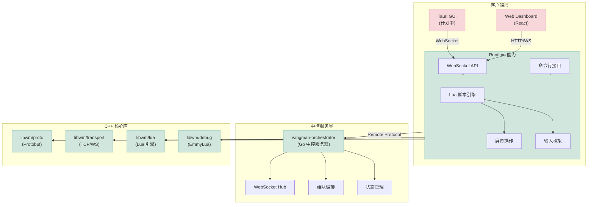

# Wingman

<div align="center">


**游戏自动化可编程控制引擎**

C++ + Lua 的高性能游戏自动化框架

[](https://github.com/cuihairu/wingman)
[](https://github.com/cuihairu/wingman/actions/workflows/ci.yml)
[](https://codecov.io/gh/cuihairu/wingman)
[](https://en.cppreference.com/w/cpp/17)
[](https://www.lua.org/)
[](https://opensource.org/licenses/Apache-2.0)

[文档](docs/) | [快速开始](#快速开始) | [API](docs/api/) | [示例](examples/)

</div>

> ⚠️ **免责声明**
>
> 本工具仅供合法场景使用，包括但不限于：自动化测试、可单机游戏辅助、无障碍辅助等。
> 使用本工具违反任何游戏或软件的用户协议所导致的后果，由使用者自行承担。
> 作者不对因使用本工具而产生的任何法律责任负责。

---

## 简介

**Wingman** 是一个游戏自动化可编程控制引擎，采用 C++ 核心引擎 + Lua 脚本的架构设计。

- 🚀 **高性能** - C++ 核心引擎，Lua 脚本执行，毫秒级响应
- 🔒 **安全可靠** - 纯用户态运行，使用合法 Windows API，不读写游戏内存
- 🎮 **可编程** - Lua 脚本控制，灵活扩展，支持复杂业务逻辑
- 🌐 **远程编排** - 支持与 Orchestrator 中控服务器协同，多机组队

---

## 架构设计



---

## 目录结构

```
wingman/
├── apps/
│   ├── runtime/          # C++ 运行时 (核心)
│   │   ├── src/          # 源代码
│   │   │   ├── commands/ # 命令实现 (start/stop/script/build/serve)
│   │   │   ├── controllers/ # HTTP/WebSocket 控制器
│   │   │   ├── agent.cpp      # Agent 主逻辑
│   │   │   ├── remote_client.cpp  # 连接 Orchestrator
│   │   │   ├── remote_server.cpp  # 作为服务器供外部连接
│   │   │   ├── standalone_mode.cpp # 单机模式
│   │   │   └── main.cpp        # 程序入口
│   │   └── include/wingman/runtime/
│   ├── gui/              # Tauri 用户界面 (计划中)
│   │   └── src-tauri/    # Rust 后端
│   ├── dashboard/        # React Web 管理界面
│   └── inspector/        # Tauri 调试工具 (未来计划)
│
├── orchestrator/         # Go 中控服务器
│   ├── internal/         # 内部包
│   │   ├── handlers/     # HTTP/WebSocket 处理器
│   │   ├── middleware/   # 中间件
│   │   └── models/       # 数据模型
│   ├── pkg/              # 公共包
│   │   ├── agent/        # Agent 客户端
│   │   └── websocket/    # WebSocket Hub
│   └── src/              # C++ 绑定代码
│
├── lib/
│   └── wingman/          # C++ 核心库
│       ├── src/
│       │   ├── screen/      # 屏幕操作 (截图/取色/图找图)
│       │   ├── input/       # 输入模拟 (鼠标/键盘)
│       │   ├── window/      # 窗口管理
│       │   ├── vision/      # 视觉算法 (OpenCV)
│       │   ├── uia/         # UI Automation
│       │   ├── ocr/         # OCR 识别
│       │   └── ml/          # ML/AI 推理 (ONNX)
│       └── include/wingman/
│
├── libs/                 # C++ 子模块库
│   ├── proto/            # Protobuf 消息定义
│   ├── transport/        # 网络传输层
│   ├── lua/              # Lua 引擎封装
│   └── debug/            # 调试支持 (EmmyLua)
│
├── examples/             # Lua 脚本示例
├── docs/                 # 项目文档
└── scripts/              # 构建脚本
```

---

## 开发计划

### 第一阶段 - 核心功能 (当前)

| 组件 | 状态 | 说明 |
|------|------|------|
| `wingman-runtime` | 🔥 开发中 | C++ 运行时，执行 Lua 脚本 |
| `wingman-orchestrator` | 🔥 开发中 | Go 中控服务器，多机编排 |
| **平台** | Windows | 第一阶段仅支持 Windows |
| **脚本** | Lua | 第一阶段仅支持 Lua (Python 未来计划) |

### 未来计划

| 计划 | 说明 |
|------|------|
| **Tauri GUI** | 桌面用户界面，替代命令行操作 |
| **SDK 被动模式** | 暴露 SDK 供外部程序调用控制能力 |
| **Python 支持** | 除 Lua 外支持 Python 脚本 |
| **Inspector** | 开发者调试工具 (取色/句柄/UIA/代码验证) |
| **跨平台** | 支持 Linux/macOS |

---

## 核心功能

| 功能模块 | 说明 |
|---------|------|
| **屏幕操作** | 截图、像素检测、颜色匹配、图像查找 (OpenCV) |
| **输入模拟** | 鼠标点击/移动、按键发送、文本输入 |
| **人性化模拟** | 贝塞尔曲线鼠标移动、随机延迟、自然操作 |
| **窗口管理** | 查找窗口、激活窗口、获取位置 |
| **进程管理** | 启动/等待/终止进程 |
| **UI Automation** | Windows UIA 自动化，操作 UI 控件 |
| **OCR 识别** | Tesseract 文字识别 (可选) |
| **ML/AI 推理** | ONNX Runtime 模型推理 (可选) |

---

## 快速开始

### 环境要求

- Windows 10/11 (x64)
- Visual Studio 2022
- CMake 3.20+
- vcpkg
- Node.js 18+ (Dashboard)

### 安装 vcpkg

```bash
git clone https://github.com/Microsoft/vcpkg.git C:\vcpkg
C:\vcpkg\bootstrap-vcpkg.bat
C:\vcpkg\vcpkg integrate install
```

### 编译 Runtime

```bash
git clone https://github.com/cuihairu/wingman.git
cd wingman

# 配置项目
cmake -B build -G "Visual Studio 17 2022" `
    -DCMAKE_TOOLCHAIN_FILE="C:/vcpkg/scripts/buildsystems/vcpkg.cmake" `
    -DVCPKG_TARGET_TRIPLET=x64-windows-static

# 编译
cmake --build build --config Release
```

### 运行

```bash
# 运行 Lua 脚本
.\build\apps\runtime\Release\wingman-runtime.exe script examples\hello.lua

# 启动 WebSocket 服务
.\build\apps\runtime\Release\wingman-runtime.exe serve

# 查看版本
.\build\apps\runtime\Release\wingman-runtime.exe --version
```

---

## 命令行接口

```bash
wingman-runtime <command> [options]

命令:
  start       启动 Agent 服务
  stop        停止服务
  status      查看服务状态
  script      运行 Lua 脚本
  build       打包脚本为独立 EXE
  serve       启动 WebSocket 服务器

选项:
  -h, --help     显示帮助信息
  -v, --version  显示版本信息
```

---

## 开发

### VSCode 开发环境

推荐使用以下插件 + 配置：

| 插件 | 用途 |
|------|------|
| [LuaLS](https://marketplace.visualstudio.com/items?itemName=sumneko.lua) | Lua 语言支持 |
| [C/C++](https://marketplace.visualstudio.com/items?itemName=ms-vscode.cpptools) | C++ 语言支持 |
| [EmmyLua](https://marketplace.visualstudio.com/items?itemName=EmmyLuaVSCode.emmylua) | Lua 调试支持 |

配置文件：`.vscode/settings.json`
```json
{
  "Lua.workspace.library": ["${workspaceFolder}/libs/lua/defs"],
  "Lua.diagnostics.globals": ["print", "wm"]
}
```

### 单元测试

```bash
cmake -B build -G "Visual Studio 17 2022" `
    -DCMAKE_TOOLCHAIN_FILE="C:/vcpkg/scripts/buildsystems/vcpkg.cmake" `
    -DWINGMAN_BUILD_TESTS=ON

cmake --build build --config Release
```

---

## 文档

- [构建指南](BUILD.md)
- [API 文档](docs/API.md)
- [架构设计](docs/architecture.md)
- [项目结构](docs/project-structure.md)

---

## Dashboard

```bash
cd dashboard
pnpm install
pnpm dev
```

访问 http://localhost:8000

---

## 许可证

[Apache-2.0](LICENSE)
