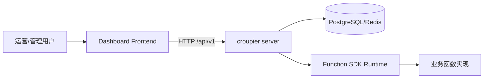
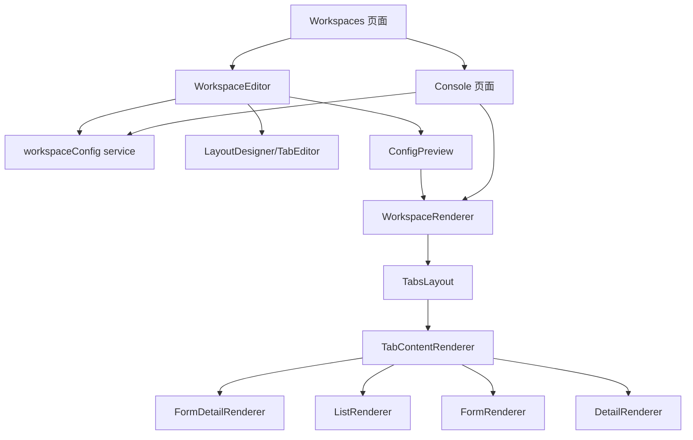
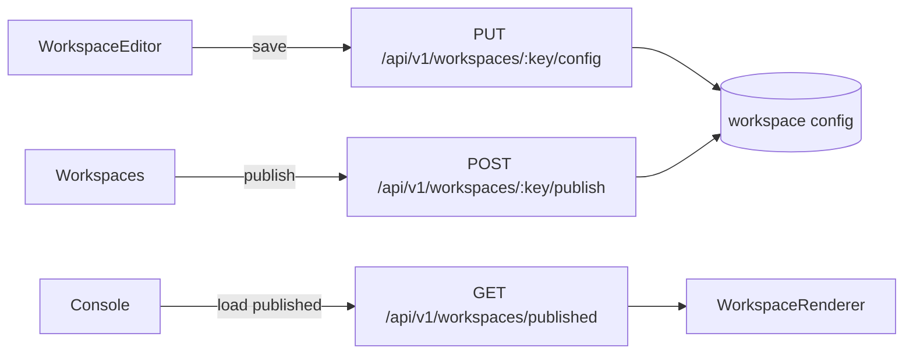
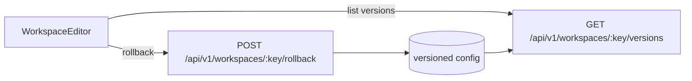

# Croupier Dashboard

<p align="left">
  <a href="https://github.com/cuihairu/croupier">
    
  </a>
  <a href="https://github.com/cuihairu/croupier-dashboard/tree/main">
    
  </a>
  
  
  <a href="https://github.com/cuihairu/croupier-dashboard/actions/workflows/dashboard-quality.yml">
    
  </a>
  <a href="https://github.com/cuihairu/croupier-dashboard/actions/workflows/docker.yml">
    
  </a>
  
  
  
  
</p>

`croupier-dashboard` 是 Croupier 的前端管理台，定位为配置驱动的对象工作台系统。

当前主线能力：

- 工作台配置与发布
- 控制台运行时渲染
- 权限控制与版本回滚入口
- 正式布局（`tabs + form-detail/list/form/detail`）
- 发布前检查、质量评分与运行态风险提示

## 在线 Demo

- 地址：<https://croupier.cuihairu.site>
- 账号：`admin`
- 密码：`admin123`
- 提示：该账号仅用于演示环境，请勿在生产环境使用默认凭据。

## 0. 图标与状态图例

- `✅` 已稳定可用（默认开启，主链路覆盖）
- `🧪` Beta/增强能力（可用，但仍在持续优化）
- `⚠️` 实验能力（代码保留，不进入默认主路径）
- `❌` 暂不支持（当前版本不建议使用）

能力状态速览：

| 能力                                        | 状态 | 说明                                 |
| ------------------------------------------- | ---- | ------------------------------------ |
| Workspace 配置保存/发布/回滚                | ✅   | 主链路能力，已接入权限和版本         |
| tabs 顶层布局                               | ✅   | 控制台与编辑器主入口                 |
| form-detail/list/form/detail                | ✅   | 核心布局闭环                         |
| kanban/timeline/split/wizard/dashboard/grid | 🧪   | 已可渲染，但默认按 Beta 能力管理     |
| custom / single / 画布编辑                  | ⚠️   | 实验能力，不作为稳定交付承诺         |
| 函数界面向导（单函数）                      | 🧪   | 辅助生成初始布局，不替代页面打磨     |
| 多函数编排向导                              | 🧪   | 辅助生成初始绑定，不等于流程引擎     |
| 发布前检查 / 质量评分                       | ✅   | 编辑器、对象工作台、控制台已统一口径 |
| 节点执行语义（Node Graph runtime）          | ❌   | 不在当前稳定交付范围                 |

## 1. 当前产品主路径

当前 dashboard 的主路径已经固定为三层：

1. 函数目录：确认对象有哪些原子能力可用
2. 对象工作台：把函数装配成页面、补骨架、做预览、执行发布前检查
3. 运行控制台：验证已发布结果、入口可见性、页面可读性与真实运行态

当前不再使用“V1/V2”作为主叙事，而是使用下面三种能力等级：

- 正式能力：允许进入默认主路径、默认模板、公开文案和正式交付承诺
- Beta 能力：可创建、可预览、可渲染，但发布前需要额外核对真实数据态和空态
- 实验能力：代码保留，但不进入默认主路径，不作为当前产品承诺

## 2. 发布与运行态规则

发布前：

- 编辑器提供发布前检查和质量评分
- 对象工作台列表会展示评分、阻塞项和风险项
- 存在硬阻塞时禁止发布
- 存在风险提示时允许发布，但会在发布前摘要中明确提醒

发布后：

- 控制台首页会显示已发布工作台的质量评分和风险提示
- 控制台详情会明确标记当前版本是否“已发布，质量稳定”或“已发布，但需重点核对”
- 控制台属于正式运行态，不会再默默回落示例内容

预览与运行态的边界：

- 编辑器预览允许示例数据和示例骨架，用于帮助搭建结构
- 控制台正式态要求真实函数、真实绑定和真实数据；缺失时会明确提示

补充交付文档：

- `docs/workspace-product-delivery-guide.md`
- `docs/workspace-governance-playbook.md`
- `docs/workspace-regression-checklist.md`

## 3. 快速开始

### 3.1 依赖要求

- Node.js `>=22.0.0`
- pnpm `>=9`

### 3.2 安装与启动

```bash
pnpm install
pnpm dev
```

默认访问：`http://localhost:8000`

### 3.3 常用命令

```bash
pnpm dev
pnpm build
pnpm test
pnpm lint
pnpm tsc
```

## 4. 当前功能边界（正式 + Beta + 实验）

正式主链路（默认建议）：

- 顶层布局：`tabs`
- Tab 布局：`form-detail`、`list`、`form`、`detail`

Beta 能力（可用但需额外核对）：

- `kanban`
- `timeline`
- `split`
- `wizard`
- `dashboard`
- `grid`

实验/辅助能力：

- 函数界面向导（单函数）
- 多函数编排向导（自动分配 + 手动改绑）
- `custom` / `single` 等实验布局兼容
- 画布编辑器与节点式增强能力
- 代码中保留的实验布局/画布模块仅供内部演进，不作为当前稳定交付范围

当前不支持：

- 节点流程执行语义（Node Graph runtime 执行）

## 5. 架构关系图（Graph）

### 5.1 系统关系



### 5.2 前端核心模块关系



### 5.3 工作台配置流转



### 5.4 版本与回滚链路



## 6. 页面与路由

关键入口：

- 工作台管理：`/system/functions/workspaces`
- 工作台详情：`/system/functions/workspaces/:objectKey`
- 工作台编辑：`/system/functions/workspace-editor/:objectKey`
- 控制台首页：`/console`
- 控制台工作台：`/console/:objectKey`

路由定义文件：

- `config/routes.ts`

## 7. 目录结构

```text
src/
  components/
    WorkspaceRenderer/
      index.tsx
      TabsLayout.tsx
      TabContentRenderer.tsx
      renderers/
  pages/
    Workspaces/
    WorkspaceEditor/
    Console/
  services/
    workspaceConfig.ts
    api/workspace.ts   # 兼容层（deprecated）
    workspace/telemetry.ts
  types/
    workspace.ts
```

## 8. Workspace 数据模型（简化）

```ts
type WorkspaceStatus = 'draft' | 'published' | 'archived';

interface WorkspaceConfig {
  objectKey: string;
  title: string;
  description?: string;
  layout: WorkspaceLayout;
  published?: boolean;
  status?: WorkspaceStatus;
  version?: number;
  publishedAt?: string;
  publishedBy?: string;
  menuOrder?: number;
  meta?: WorkspaceMeta;
}
```

## 9. API 约定（前端使用）

工作台配置：

- `GET /api/v1/workspaces/:objectKey/config`
- `PUT /api/v1/workspaces/:objectKey/config`
- `GET /api/v1/workspaces/configs`
- `DELETE /api/v1/workspaces/:objectKey/config`

发布与运行：

- `POST /api/v1/workspaces/:objectKey/publish`
- `POST /api/v1/workspaces/:objectKey/unpublish`
- `GET /api/v1/workspaces/published`

版本能力（已接前端服务，待后端联调确认）：

- `GET /api/v1/workspaces/:objectKey/versions`
- `POST /api/v1/workspaces/:objectKey/rollback`

## 10. 权限模型（前端）

已使用的工作台权限键：

- `workspaces:read`
- `workspaces:edit`
- `workspaces:publish`
- `workspaces:rollback`
- `workspaces:delete`

聚合能力：

- `canWorkspaceManage` = 以上权限的聚合

## 11. 埋点事件（前端）

事件通过 `window.dispatchEvent(new CustomEvent('croupier:workspace'))` 发送。

核心事件：

- `workspace_load` / `workspace_load_error`
- `workspace_save` / `workspace_save_error`
- `workspace_publish` / `workspace_publish_error`
- `workspace_unpublish` / `workspace_unpublish_error`
- `workspace_versions_load` / `workspace_versions_load_error`
- `workspace_rollback` / `workspace_rollback_error`
- `workspace_template_apply` / `workspace_template_apply_error`

## 10. 开发约束

- `services/workspaceConfig.ts` 是工作台主 service，不再新增重复契约
- 新增布局必须同时完成：
  - 类型定义
  - 编辑器配置 UI
  - 保存校验
  - 运行时 renderer
  - 测试覆盖
- 未闭环能力不得直接暴露在主 UI

## 11. 与主仓库关系

- 主仓库：`https://github.com/cuihairu/croupier`
- 本仓库负责前端管理台，不负责业务函数实现

## 12. License

Apache-2.0
