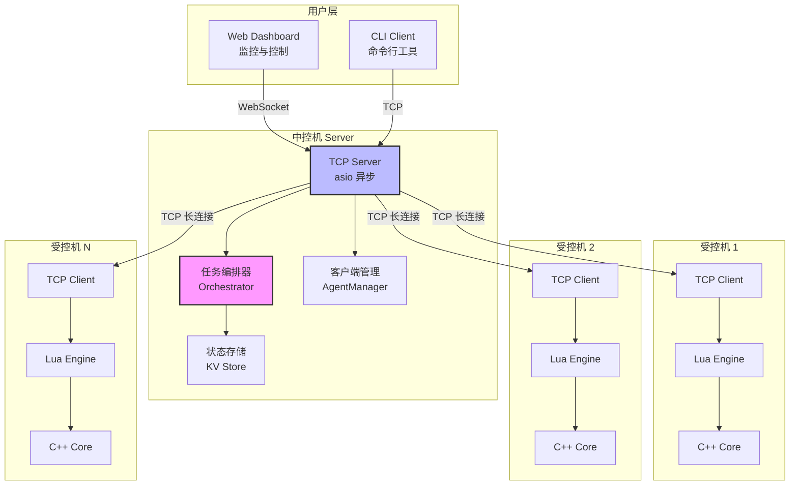
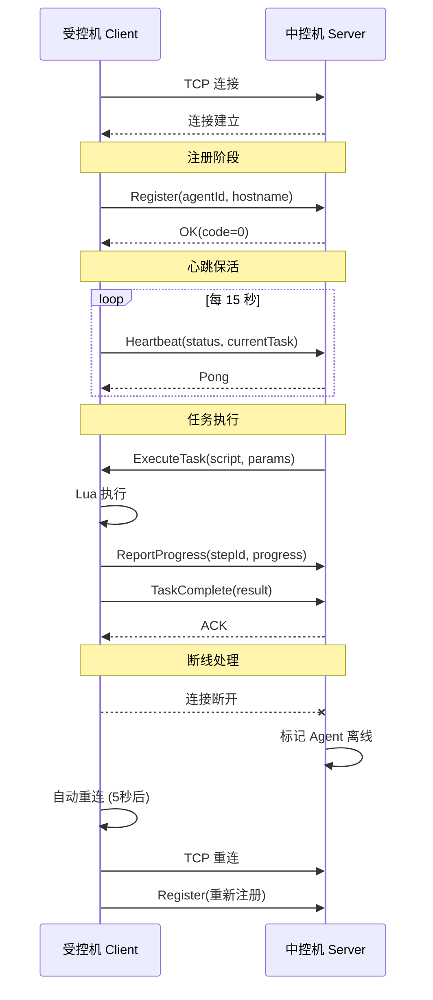
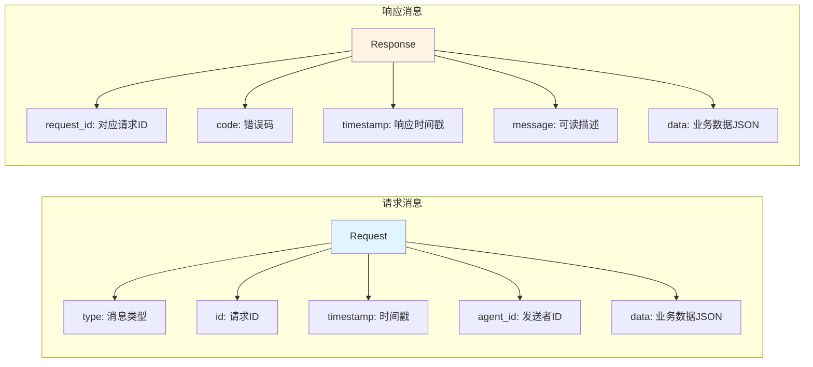
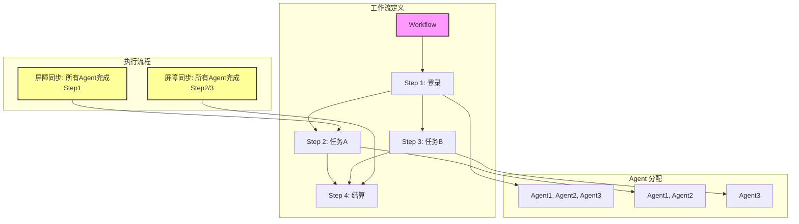
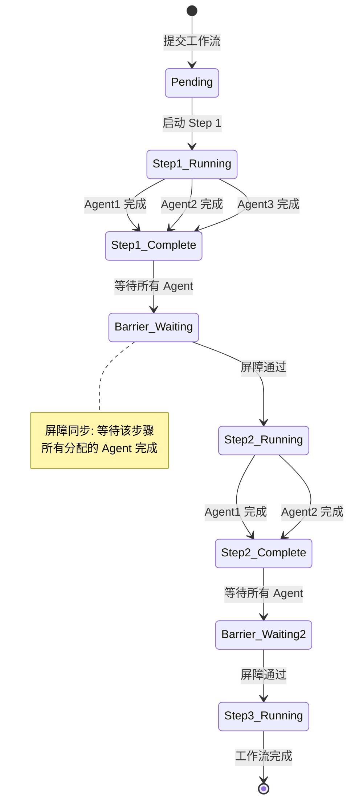
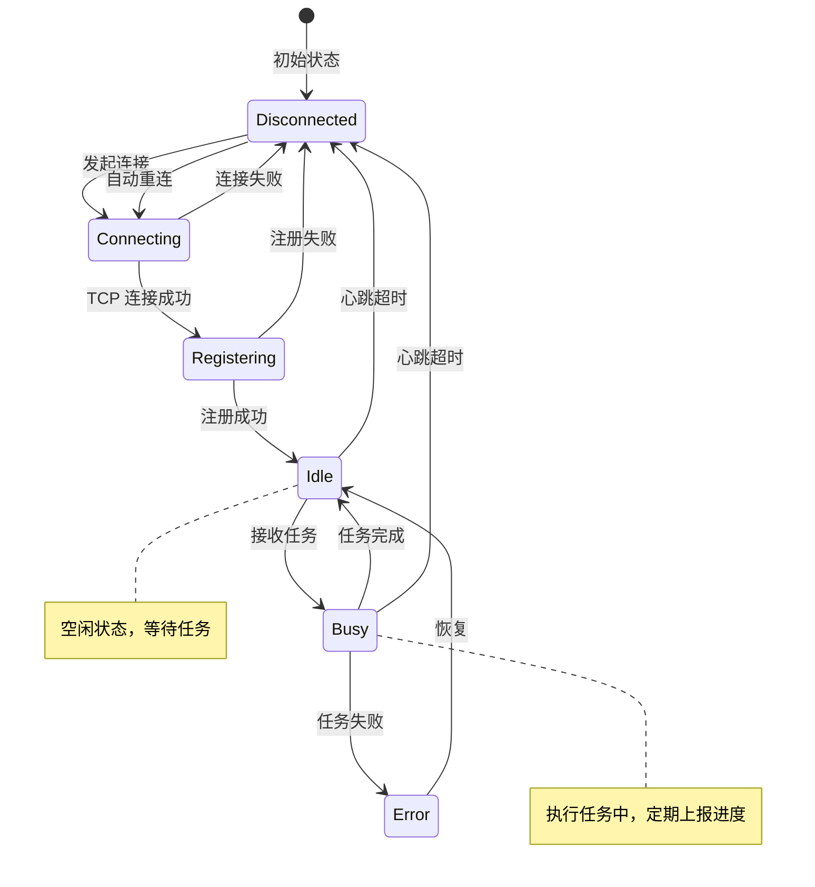

# 架构设计

## 系统架构概览



## 中控机-受控机架构

### 通信协议



### TCP 消息格式



#### 信封协议

```
┌─────────────────────────────────────────────────────────┐
│  长度(16进制)\n                                          │
│  {"type":"heartbeat","id":"xxx","timestamp":...}\n      │
└─────────────────────────────────────────────────────────┘
```

#### 错误码定义

| Code | 名称 | 说明 |
|------|------|------|
| 0 | OK | 成功 |
| 1 | UNKNOWN | 未知错误 |
| 2 | INVALID_REQUEST | 请求格式错误 |
| 3 | NOT_FOUND | 资源未找到 |
| 4 | TIMEOUT | 操作超时 |
| 5 | BUSY | 服务忙碌 |
| 6 | NOT_AUTHORIZED | 未授权 |
| 7 | ALREADY_EXISTS | 资源已存在 |
| 8 | FAILED | 操作失败 |
| 9 | DISCONNECTED | 连接断开 |
| 10 | RATE_LIMITED | 请求频率限制 |
| **1024+** | **用户自定义** | **业务错误码** |

## 多账号协作编排

### 工作流模型



### 屏障同步机制



### Agent 状态机



## 核心模块

### 中控机模块

| 模块 | 职责 | 文件 |
|-----|------|------|
| **TCPServer** | TCP 长连接服务 | `server/src/server.cpp` |
| **AgentManager** | 客户端会话管理 | `server/src/agent_manager.cpp` |
| **Orchestrator** | 任务编排引擎 | `server/src/orchestrator.cpp` |
| **WorkflowStore** | 工作流状态存储 | `server/src/workflow_store.cpp` |

### 受控机模块

| 模块 | 职责 | 文件 |
|-----|------|------|
| **TCPClient** | TCP 客户端 | `server/src/client.cpp` |
| **Heartbeat** | 心跳保活 | `server/src/heartbeat.cpp` |
| **TaskExecutor** | 任务执行器 | `server/src/task_executor.cpp` |

### 核心能力模块

| 模块 | 职责 | 文件 |
|-----|------|------|
| **Screen** | 屏幕操作 | `src/screen.cpp` |
| **Input** | 输入模拟 | `src/input.cpp` |
| **Window** | 窗口管理 | `src/window.cpp` |
| **Process** | 进程管理 | `src/process.cpp` |
| **Recorder** | 宏录制 | `src/recorder.cpp` |
| **Trigger** | 触发器系统 | `src/trigger.cpp` |
| **Storage** | 存储系统 | `src/storage.cpp` |
| **Verification** | 验证码能力 | `src/verification.cpp` |
| **QRCode** | 二维码登录 | `src/qrcode.cpp` |

## C++ / Lua 分层

```
┌─────────────────────────────────────────────────────────────────┐
│                    分层决策                                      │
├─────────────────────────────────────────────────────────────────┤
│                                                                  │
│   C++ 实现                    Lua 实现                         │
│   ────────                    ─────────                         │
│                                                                  │
│   ├── 性能敏感操作                ├── 业务逻辑                  │
│   ├── 系统调用                    ├── 状态机                    │
│   ├── 内存操作                    ├── 触发器组合                │
│   ├── 图像处理                    ├── 用户自定义行为            │
│   └── TCP/网络通信                └── 脚本编排                  │
│                                                                  │
└─────────────────────────────────────────────────────────────────┘
```

## 目录结构

```
wingman/
├── .github/workflows/       # CI/CD 配置
├── docs/                    # VitePress 文档
├── server/                  # 网络服务层
│   ├── include/wingman/server/
│   │   ├── server.hpp       # TCP Server
│   │   ├── client.hpp       # TCP Client
│   │   ├── protocol.hpp     # 通信协议
│   │   └── orchestrator.hpp # 任务编排
│   └── src/
├── src/                     # C++ 核心引擎
├── include/wingman/         # 公共头文件
├── bindings/                # Lua 绑定
├── scripts/                 # Lua 脚本示例
└── tests/                   # 测试
```
