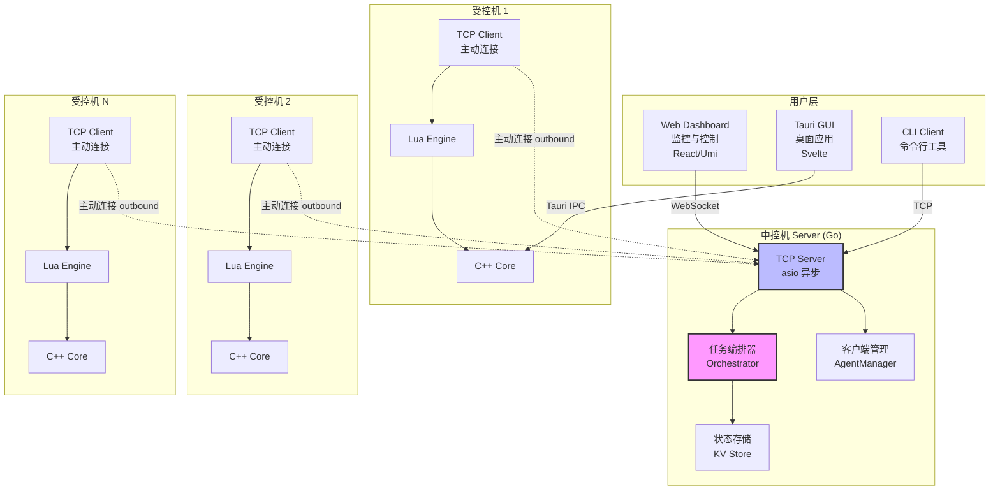
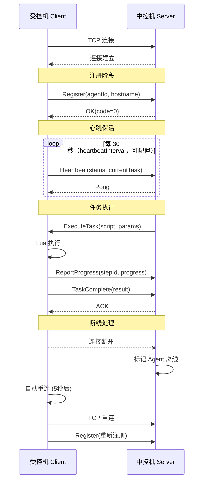
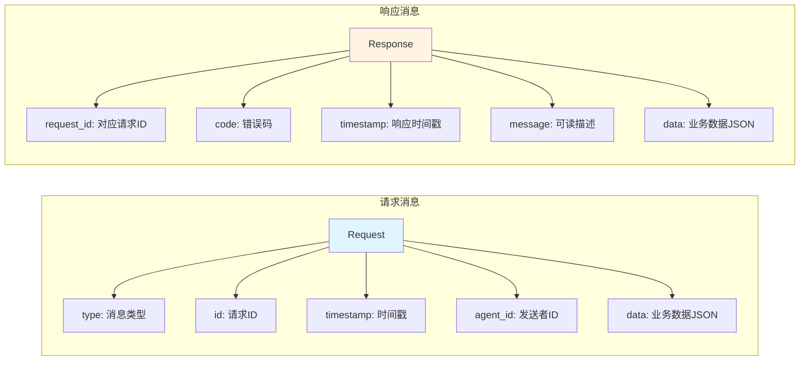
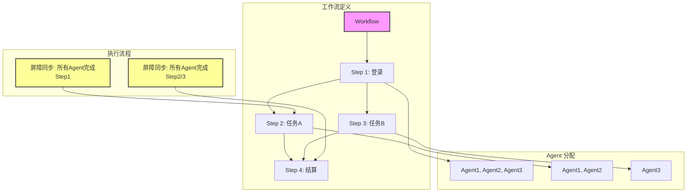
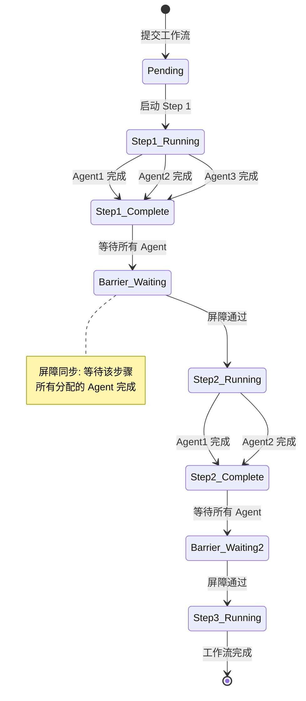
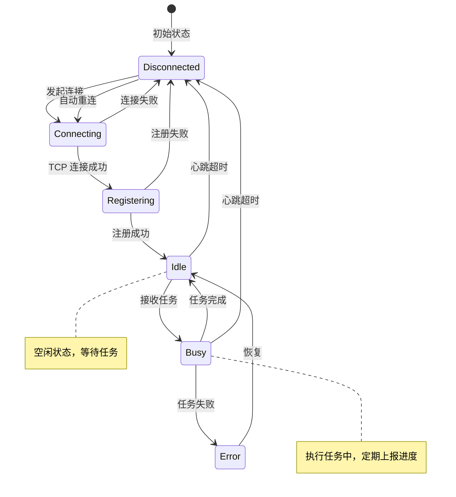

# 架构设计

## 系统架构概览


```mermaid
graph TB
    subgraph "用户层"
        UI[Web Dashboard<br/>监控与控制<br/>React/Umi]
        GUI[Tauri GUI<br/>桌面应用<br/>Svelte]
        CLI[CLI Client<br/>命令行工具]
    end

    subgraph "中控机 Server (Go)"
        Orchestrator[任务编排器<br/>Orchestrator]
        AgentMgr[客户端管理<br/>AgentManager]
        TCPServer[TCP Server<br/>asio 异步]
        Storage[状态存储<br/>KV Store]
    end

    subgraph "受控机 1"
        Client1[TCP Client<br/>主动连接]
        Lua1[Lua Engine]
        Core1[C++ Core]
    end

    subgraph "受控机 2"
        Client2[TCP Client<br/>主动连接]
        Lua2[Lua Engine]
        Core2[C++ Core]
    end

    subgraph "受控机 N"
        ClientN[TCP Client<br/>主动连接]
        LuaN[Lua Engine]
        CoreN[C++ Core]
    end

    UI -->|WebSocket| TCPServer
    GUI -->|Tauri IPC| Core1
    CLI -->|TCP| TCPServer
    TCPServer --> AgentMgr
    TCPServer --> Orchestrator
    Orchestrator --> Storage

    Client1 -.->|主动连接 outbound| TCPServer
    Client2 -.->|主动连接 outbound| TCPServer
    ClientN -.->|主动连接 outbound| TCPServer

    Client1 --> Lua1
    Client2 --> Lua2
    ClientN --> LuaN

    Lua1 --> Core1
    Lua2 --> Core2
    LuaN --> CoreN

    style Orchestrator fill:#f9f,stroke:#333,stroke-width:2px
    style TCPServer fill:#bbf,stroke:#333,stroke-width:2px
```

## 中控机-受控机架构

### 通信协议


```mermaid
sequenceDiagram
    participant C as 受控机 Client
    participant S as 中控机 Server

    C->>S: TCP 连接
    S-->>C: 连接建立

    Note over C,S: 注册阶段
    C->>S: Register(agentId, hostname)
    S-->>C: OK(code=0)

    Note over C,S: 心跳保活
    loop 每 30 秒（heartbeatInterval，可配置）
        C->>S: Heartbeat(status, currentTask)
        S-->>C: Pong
    end

    Note over C,S: 任务执行
    S->>C: ExecuteTask(script, params)
    C->>C: Lua 执行
    C->>S: ReportProgress(stepId, progress)
    C->>S: TaskComplete(result)
    S-->>C: ACK

    Note over C,S: 断线处理
    C--xS: 连接断开
    S->>S: 标记 Agent 离线
    C->>C: 自动重连 (5秒后)
    C->>S: TCP 重连
    C->>S: Register(重新注册)
```

### TCP 消息格式


```mermaid
graph LR
    subgraph "请求消息"
        A[Request] --> B[type: 消息类型]
        A --> C[id: 请求ID]
        A --> D[timestamp: 时间戳]
        A --> E[agent_id: 发送者ID]
        A --> F[data: 业务数据JSON]
    end

    subgraph "响应消息"
        G[Response] --> H[request_id: 对应请求ID]
        G --> I[code: 错误码]
        G --> J[timestamp: 响应时间戳]
        G --> K[message: 可读描述]
        G --> L[data: 业务数据JSON]
    end

    style A fill:#e1f5ff
    style G fill:#fff4e1
```

#### 信封协议

每帧为「4 字节二进制长度前缀 + JSON payload」，无分隔符/换行：

```
┌─────────────────────────────────────────────────────────┐
│  长度前缀（4 字节二进制）                                 │
│  {"type":"heartbeat",...}          ← JSON payload        │
└─────────────────────────────────────────────────────────┘
```

- C++ 侧（`libs/transport/`）以网络字节序写入/读取长度前缀。
- Go 侧（`orchestrator/server`）按宿主机字节序解码长度前缀。

#### 错误处理

当前远程协议没有统一的数字错误码表。错误语义由具体消息类型的字段表达（如 `error` / `message` 字符串字段，token 校验失败返回 `error: "invalid or missing token"`）；Dashboard 与 Go server 之间的 REST 接口使用标准 HTTP 状态码。

## 多账号协作编排

### 工作流模型


```mermaid
graph TB
    subgraph "工作流定义"
        WF[Workflow]
        S1[Step 1: 登录]
        S2[Step 2: 任务A]
        S3[Step 3: 任务B]
        S4[Step 4: 结算]

        WF --> S1
        S1 --> S2
        S1 --> S3
        S2 --> S4
        S3 --> S4
    end

    subgraph "Agent 分配"
        S1 --> A1[Agent1, Agent2, Agent3]
        S2 --> A2[Agent1, Agent2]
        S3 --> A3[Agent3]
    end

    subgraph "执行流程"
        B1[屏障同步: 所有Agent完成Step1] --> S2
        B2[屏障同步: 所有Agent完成Step2/3] --> S4
    end

    style WF fill:#f9f,stroke:#333,stroke-width:2px
    style B1 fill:#ff9,stroke:#333,stroke-width:2px
    style B2 fill:#ff9,stroke:#333,stroke-width:2px
```

### 屏障同步机制


```mermaid
stateDiagram-v2
    [*] --> Pending: 提交工作流

    Pending --> Step1_Running: 启动 Step 1
    Step1_Running --> Step1_Complete: Agent1 完成
    Step1_Running --> Step1_Complete: Agent2 完成
    Step1_Running --> Step1_Complete: Agent3 完成

    Step1_Complete --> Barrier_Waiting: 等待所有 Agent
    Barrier_Waiting --> Step2_Running: 屏障通过

    Step2_Running --> Step2_Complete: Agent1 完成
    Step2_Running --> Step2_Complete: Agent2 完成

    Step2_Complete --> Barrier_Waiting2: 等待所有 Agent
    Barrier_Waiting2 --> Step3_Running: 屏障通过

    Step3_Running --> [*]: 工作流完成

    note right of Barrier_Waiting
        屏障同步: 等待该步骤
        所有分配的 Agent 完成
    end note
```

### Agent 状态机


```mermaid
stateDiagram-v2
    [*] --> Disconnected: 初始状态

    Disconnected --> Connecting: 发起连接
    Connecting --> Registering: TCP 连接成功
    Registering --> Idle: 注册成功

    Idle --> Busy: 接收任务
    Busy --> Idle: 任务完成
    Busy --> Error: 任务失败

    Idle --> Disconnected: 心跳超时
    Busy --> Disconnected: 心跳超时
    Error --> Idle: 恢复

    Registering --> Disconnected: 注册失败
    Connecting --> Disconnected: 连接失败

    Disconnected --> Connecting: 自动重连

    note right of Idle
        空闲状态，等待任务
    end note

    note right of Busy
        执行任务中，定期上报进度
    end note
```

## 核心模块

### 控制平面模块

| 模块 | 职责 | 文件 |
|-----|------|------|
| **Go Orchestrator** | 任务编排、节点管理、工作流调度 | `orchestrator/server/` |
| **Dashboard** | Web 控制台与可视化监控 | `orchestrator/dashboard/` |

### 执行平面模块

| 模块 | 职责 | 文件 |
|-----|------|------|
| **RemoteClient** | 主动连接编排器并收发任务 | `libs/agentcore/src/remote_client.cpp` |
| **Transport** | 连接、会话与消息收发 | `libs/transport/` |
| **Runtime Agent** | 本机任务执行与状态上报 | `apps/agent/` |

### 核心能力模块

| 模块 | 职责 | 文件（`lib/wingman/src/`） |
|-----|------|------|
| **Screen** | 屏幕操作 | `screen.cpp` + `platform/{win,linux,mac}/*_screen.cpp` |
| **Input** | 输入模拟 | `platform/win/sendinput_input.cpp`、`platform/linux/xtest_input.cpp`、`platform/mac/cgevent_input.cpp` |
| **Window** | 窗口管理 | `window.cpp` + `platform/{win,linux,mac}/*_window.cpp` |
| **Process** | 进程管理 | `platform/win/win32_process.cpp`、`platform/{linux,mac}/posix_process.cpp` |
| **Recorder** | 宏录制 | `platform/{win,linux,mac}/*_recorder.cpp` + `script/modules/macro_module.cpp` |
| **Trigger** | 触发器系统 | `trigger_engine.cpp`、`smart_trigger.cpp` + `platform/win/win32_trigger.cpp` |
| **Storage** | 存储系统 | `storage.cpp`、`kvstore.cpp` |
| **Verification** | 验证码能力 | `verification.cpp` |

## C++ / Lua 分层

```
┌─────────────────────────────────────────────────────────────────┐
│                    分层决策                                      │
├─────────────────────────────────────────────────────────────────┤
│                                                                  │
│   C++ 实现                    Lua 实现                         │
│   ────────                    ─────────                         │
│                                                                  │
│   ├── 性能敏感操作                ├── 业务逻辑                  │
│   ├── 系统调用                    ├── 状态机                    │
│   ├── 内存操作                    ├── 触发器组合                │
│   ├── 图像处理                    ├── 用户自定义行为            │
│   └── TCP/网络通信                └── 脚本编排                  │
│                                                                  │
└─────────────────────────────────────────────────────────────────┘
```

## 目录结构

```
wingman/
├── .github/workflows/       # CI/CD 配置
├── apps/                    # 应用程序
│   ├── runtime/             # C++ 运行时（主动 Agent）
│   │   └── src/
│   │       ├── agent.cpp            # Agent 主逻辑
│   │       ├── local_ipc_server.cpp # 本地 IPC 服务（Tauri GUI 控制通道）
│   │       ├── standalone_mode.cpp
│   │       └── commands/            # CLI 子命令
│   ├── gui/                 # Tauri/Svelte GUI
│   │   ├── src-tauri/
│   │   └── src/
│   └── android/             # Android Agent
├── lib/wingman/             # C++ 核心引擎
├── libs/                    # 辅助库
│   ├── lua/                 # Lua 绑定
│   ├── python/              # Python 绑定
│   ├── transport/           # TCP 传输层（帧协议）
│   ├── agentcore/           # 远程客户端核心（RemoteClient）
│   └── androidagent/        # Android Agent 库
├── orchestrator/            # 编排层
│   ├── dashboard/           # Web 控制面板 (React/Umi)
│   └── server/              # Go 服务端
├── examples/lua_scripts/    # Lua 脚本示例
├── docs/                    # 文档
└── scripts/                 # 构建/校验工程脚本
```

测试随各库存放（`lib/wingman/tests/`、`libs/lua/tests/`、`libs/python/tests/`），无顶层 tests/ 目录。
